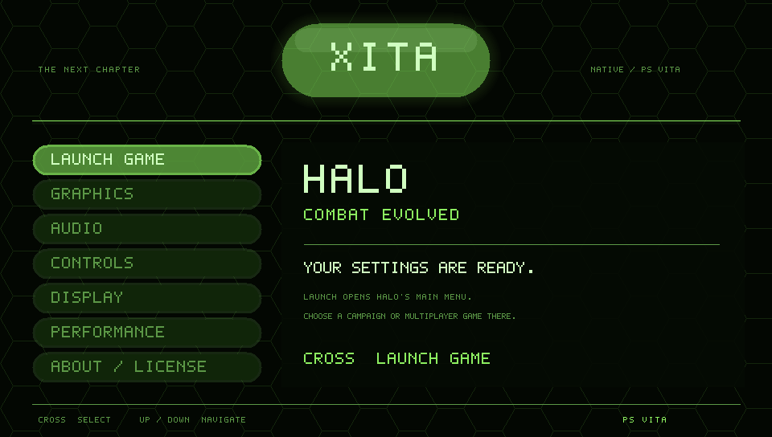
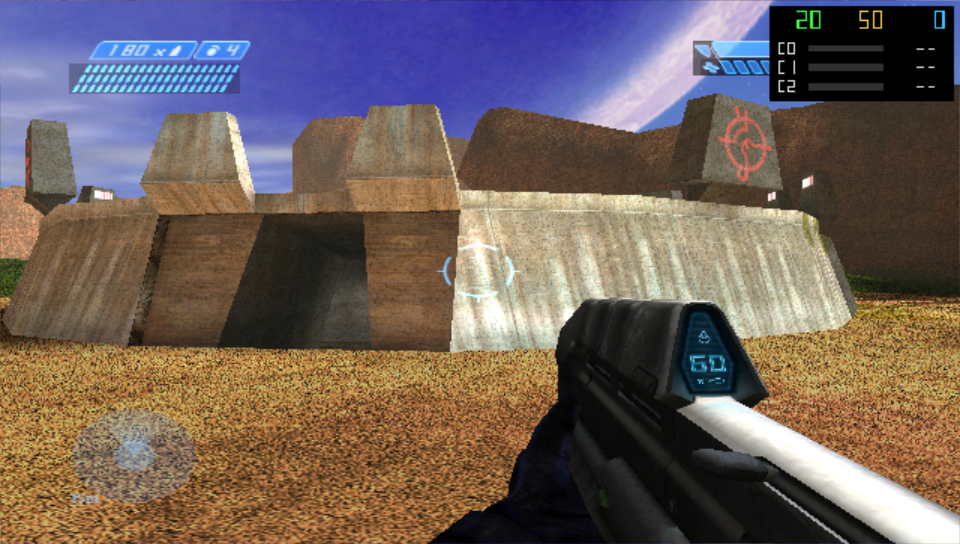
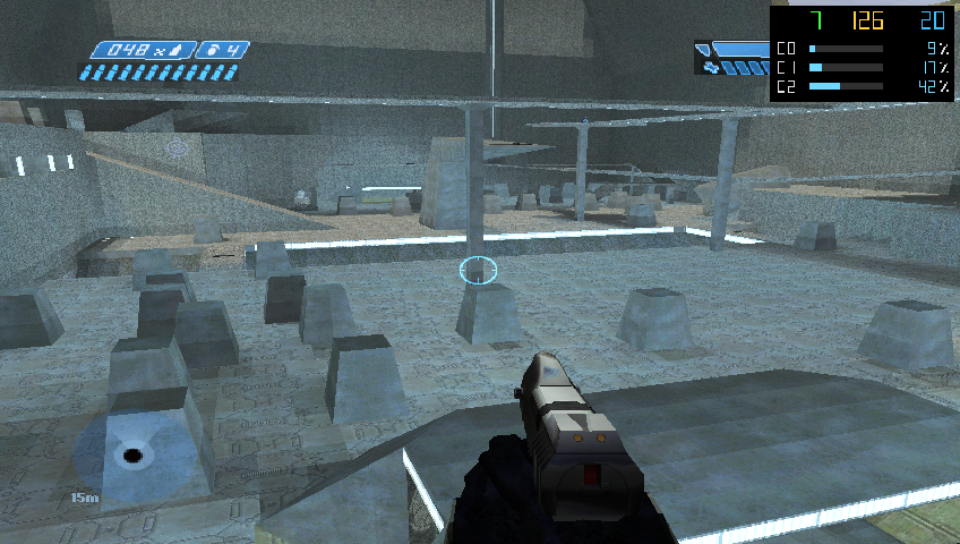
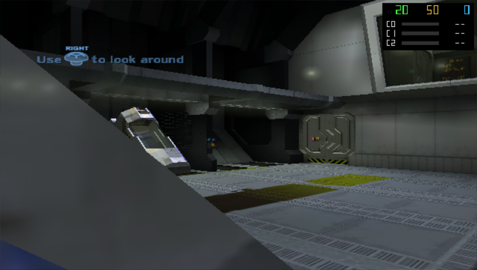

<p align="center">
  
</p>

<h1 align="center">Xita</h1>

**A static recompiler and runtime for bringing original Xbox games to the PlayStation Vita.**

[Download VPK](https://github.com/BirchWoodGod/xita/releases/tag/dev-20260908-vertex-references) · [Install](docs/installing.md) · [Compatibility](COMPATIBILITY.md) · [Roadmap](ROADMAP.md) · [Contribute](CONTRIBUTING.md) · [GPL license](LICENSE)

Xita translates an Xbox game's x86 executable into C, builds it as ARM code,
and supplies Xbox kernel, graphics and audio interfaces through Vita homebrew
libraries. Each title needs its own port and testing. **Halo: Combat Evolved
is the only game tested so far.**

## Getting started

1. **Download the VPK** from the [current Xita release](https://github.com/BirchWoodGod/xita/releases/tag/dev-20260908-vertex-references).
   Expand **Assets** and choose its single `.vpk` file. The **Source code** ZIP is for developers.
2. **Copy it over USB.** Open VitaShell's USB mode and copy the VPK to your Vita's
   storage. Windows users can use File Explorer; installing a VPK needs no compiler or WSL.
3. **Install and add your game data.** Safely eject the drive, leave USB mode, and
   open the VPK in VitaShell. On first setup, copy your own supported Halo image
   and maps using the [installation guide](docs/installing.md).
4. **Launch Xita.** Choose your graphics settings and select **Launch Game**.
   Start a campaign or a solo match through Halo's **Split Screen** menu.

**Already have Xita working?** Keep your existing game files, settings and saves;
follow [Updating Xita](docs/installing.md#updating-xita). The current
[game release](https://github.com/BirchWoodGod/xita/releases/tag/dev-20260908-vertex-references)
contains one VPK, a checksum and build information. Older builds have their own
releases marked **Superseded**; the [ad hoc tester](https://github.com/BirchWoodGod/xita/releases/tag/adhoc-20260908b)
is a separate download. [Release guide](docs/releases.md). Releases remain private
during development.

**First installation?** You need a homebrew-enabled Vita, VitaShell and your own
supported original Xbox copy of Halo CE. The VPK does not include the game image
or maps. [Prepare your game data](docs/game-data.md) once, then use VPKs for app updates.

### Create halo_image.bin from your .xbe

`halo_image.bin` is generated from your own Xbox Halo CE **`default.xbe`**.
It is not a separate download, and renaming the `.xbe` will not work.
If Halo already runs on your Vita, keep the image you have and skip this step.

Install Python 3, then download [xbe_parse.py](recompiler/xbe_parse.py) and
[xbe_image.py](recompiler/xbe_image.py) with **Download raw file** on each file page.
Place both scripts beside your extracted `haloce/` folder, which contains
`default.xbe` and `maps/`. Open a terminal in the folder containing the scripts.

**Windows — Command Prompt:**

```bat
py -3 xbe_parse.py haloce\default.xbe --json > game_manifest.json
py -3 xbe_image.py haloce\default.xbe game_manifest.json halo_image.bin
```

**Linux / macOS:**

```sh
python3 xbe_parse.py haloce/default.xbe --json > game_manifest.json
python3 xbe_image.py haloce/default.xbe game_manifest.json halo_image.bin
```

This creates **`halo_image.bin` beside the scripts**. Copy it to
**`ux0:data/xita/halo_image.bin`**, and copy your `haloce/` folder to
**`ux0:data/xita/haloce/`**. There should be only one `haloce` folder: the menu map
must be at `ux0:data/xita/haloce/maps/ui.map`. Your executable must match the
[supported Xbox revision](docs/game-data.md#supported-game-copy).

## Screenshots

Actual development captures; select an image to view it at full size.

| Xita dashboard · Vita3K · September 8 | Halo CE: Blood Gulch · Vita3K · September 8 |
| --- | --- |
| [](docs/images/dashboard-vita3k.png) | [](docs/images/blood-gulch-vita3k.png) |
| **Halo CE: campaign · physical Vita · September 5** | **Halo CE: cryo bay · Vita3K · September 8** |
| [](docs/images/campaign-vita.png) | [](docs/images/cryo-vita3k.png) |

The emulator's **20 FPS** overlay is a test cap, not a Vita measurement.
These captures show different development builds. [Image details](docs/images/README.md).

## Current status

This is a development project, not a finished Halo port. Rendering has improved
substantially, but performance and GPU stability still need work. The first
target is **sustained 20 FPS on real hardware**; it has not been met.

| Area | Current position |
| --- | --- |
| Dashboard | Launch Game and settings; triple buffering and About / License installed September 8, hardware testing pending |
| Blood Gulch | September 7 hardware sample: about **11 FPS at 640×360**, including driving, shooting and looking around |
| Campaign | The Pillar of Autumn reaches gameplay; camera recovery, AI, resume and completion need further hardware testing |
| Rendering | Major improvements to loading, lighting, sky, decals, foliage and active camouflage; remaining regressions are tracked |
| Stability | Earlier driving and rocket/death tests crashed the GPU; one follow-up with the constant-buffer candidate produced no new dump |
| Multiplayer | Solo matches through Split Screen work; networking between Vitas is unverified |
| Other games | Future work; installing another XBE does not make it supported |

See [Compatibility](COMPATIBILITY.md) and the
[latest hardware report](docs/hardware-20260907-frame-constants.md) for test
limits. Emulator FPS does not predict Vita performance.

The [September 8 USB update](docs/hardware-20260908-weapon-menu.md) installs
weapon, lobby and audio corrections plus the deferred visibility comparison.
Installation is verified; gameplay and performance results for this build are pending.

## Dashboard and controls

Graphics includes textures, filtering, mip smoothing, resolution, materials,
glow, particles, decals, a frame limit, compressed textures and experimental
**triple buffering**. Triple buffering defaults off.
It may increase input delay and is not a guaranteed FPS boost.

Use **Up/Down** to navigate, **Cross** to select, **Left/Right** to change a
setting, and **Circle** to go back. Changes save automatically. **About / License**
includes the full GPL for offline reading. See the [dashboard guide](dashboard/README.md).

During play, press **Select + Circle** to open the graphics overlay. Resolution,
filtering, mip smoothing, frame limit and triple buffering apply during play.
Other options are labeled **Relaunch Xita to apply**. Changes save automatically;
**Circle** closes the panel. The game continues behind it, so pause Halo with
**Start** first when needed. See [in-game settings](docs/in-game-settings.md).

| Vita control | Halo action |
| --- | --- |
| Left / right stick | Move / look |
| Cross / Circle | Jump / melee |
| Square / Triangle | Action or reload / switch weapon |
| L / R | Grenade / fire |
| Start | Pause |
| D-pad down / up | Crouch / zoom |
| D-pad right / left | Flashlight / switch grenade |

Rear touch shortcuts default off. Profiling controls are in [Developer notes](docs/development.md).

## Roadmap

The full plan is **[ROADMAP.md](ROADMAP.md)**. Near-term work focuses on GPU
stability, visibility waits and draw preparation. A future **game selector**
will discover separately recompiled, supported titles and launch each with its
own settings and saves. Halo 2 is an untested future target, not a promised port.

## Reporting problems

Include the build, Vita or Vita3K, map, graphics settings, actions taken and FPS.
Review logs before sharing: diagnostics can contain game shader definitions,
memory data and local paths. Do not post executables, maps, firmware, SDK files
or unfiltered crash dumps. See [Compatibility](COMPATIBILITY.md#reporting-a-test).

## Contributing and license

Please read [CONTRIBUTING.md](CONTRIBUTING.md) before opening a pull request.
PRs need a focused change, relevant validation and clear source/license provenance.

To work on the code, see [Building from source](docs/building.md),
[Windows / WSL developer setup](docs/windows.md) and the
[modular architecture](docs/modular-architecture.md). Source builds currently
require additional development inputs described in the build guide.
Public-release preparation is tracked in the [release audit](docs/release-audit.md).

The source is organized into [runtime/](runtime/README.md) for the Vita renderer
and application, [recompiler/](recompiler/README.md) for the offline pipeline,
and [games/](games/) for title profiles. See the [project layout](docs/project-layout.md)
for the remaining folders and local build inputs.

Xita's original code and documentation are **GPL-3.0-only**. See [LICENSE](LICENSE),
[NOTICE](NOTICE) and [third-party notices](THIRD_PARTY.md). This does not grant
rights to game content or proprietary platform components.

Development uses AI-assisted tools, including Claude Code and Codex, with the
author directing the work and testing on Vita and Vita3K. Contributions still
need review, tests and clear provenance.

Xita is independent of Microsoft, Xbox, Bungie, Halo Studios and Sony. Game and
platform names identify compatibility; trademarks belong to their owners.
