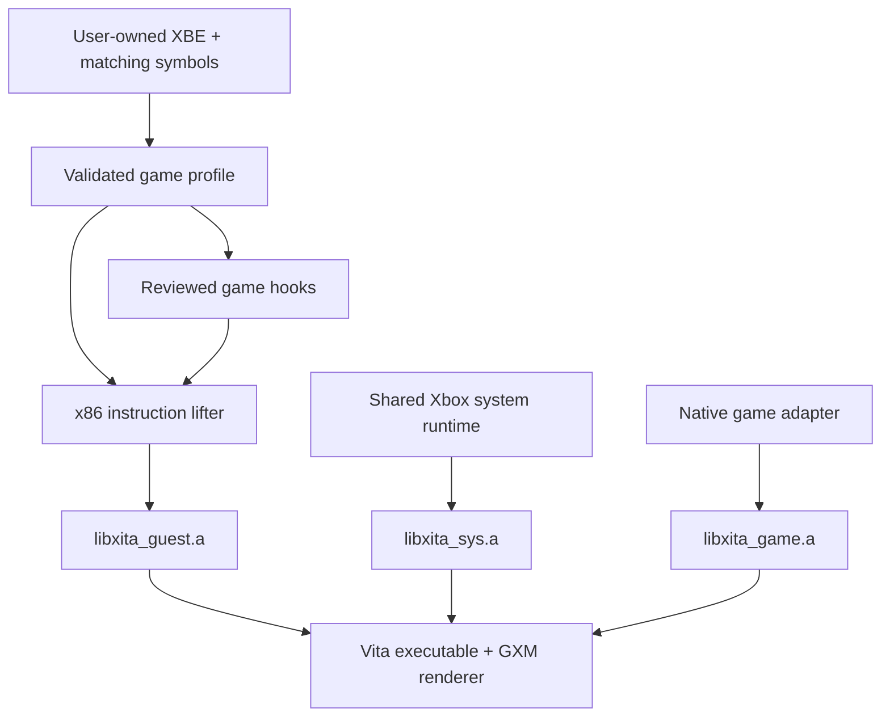

# Game profiles and modular libraries

[README](../README.md) · [Roadmap](../ROADMAP.md) · [Build guide](building.md)

Xita now has a versioned game-profile interface and separate static archives
for the shared system runtime, native game adapter, and translated game.
**Halo CE 3925 is still the only tested title.** This is the first extraction
step, not automatic compatibility with another XBE.



## Boundaries implemented

| Module | Responsibility |
| --- | --- |
| `recompiler/xita_recomp.py` | XBE discovery and x86-to-C lowering. Its default emitter has no game hooks. VitaSDK produces ARM instructions from the resulting C. |
| `recompiler/core/system.py` | Shared XDK library/symbol policy for lifting versus HLE. |
| `recompiler/core/profile.py` | Strict JSON loading, schema checks, XBE/title/manifest validation, HLE signatures, roots and variable mappings. |
| `recompiler/core/hooks.py` | No-op interface for instruction, function-entry, body and postprocessing callbacks. |
| `games/halo_ce_3925/` | Halo profile, reviewed emission hooks and the native-adapter source list. |
| `libxita_guest.a` | Generated functions, dispatch table and compatibility stubs. |
| `libxita_sys.a` | Shared execution support and kernel/Direct3D/DirectSound/XNet implementation objects. |
| `libxita_game.a` | Halo quality, math, polygon clipping, flare scheduling and geometry helper objects. |

The GXM renderer remains in the application build. Some older system files
still contain Halo-specific behavior, including save signing, map processing,
boot paths, graphics recognition and diagnostics. Those need further adapter
extraction before this runtime can serve another game unchanged. The five
clearly game-specific helper files keep their existing paths for differential
tests but belong to the game archive, not the shared archive.

Strong system and game implementations are linked with `--whole-archive` before
the generated fallback stubs. This prevents weak declarations from leaving an
implemented HLE function bound to a compatibility stub. Archives are recreated
when their source lists change so obsolete members cannot survive.

## Use a profile

```sh
python -m recompiler --list-profiles
python -m recompiler haloce/default.xbe --profile halo_ce_3925 \
  --symbols local/halo_ce_3925/halo_symbols.json --check-profile
python -m recompiler haloce/default.xbe --profile halo_ce_3925 \
  --symbols local/halo_ce_3925/halo_symbols.json -o recomp/
make RECOMP=1 GAME_PROFILE=halo_ce_3925
```

`tools/recomp.sh` remains the Halo convenience entry point. It now selects the
profile instead of carrying 28 address overrides or calling the lobby patch
unconditionally. The profile applies that patch after generation. An optional
`--manifest` must match metadata parsed from the actual executable; otherwise
Xita parses the XBE itself. The profile pins the local symbols file too.

Without `--profile`, the CLI performs a generic lift with the shared XDK policy
and no game adapter. That is useful for new ports and compiler tests; it does
not build a playable Vita port by itself. Use separate output directories for
separate games. Newly generated reports record the profile and XBE SHA-256;
Xita rejects reusing such a directory for another identity. Legacy outputs
without those fields can migrate once. Failed game postprocessing leaves the
existing generated files intact, and successful generation removes obsolete
numbered chunks while retaining handwritten files.

## Profile schema 1

Profiles are JSON, supported by Python's standard library. See the complete
[Halo profile](../games/halo_ce_3925/profile.json) for the working example.

| Field | Meaning |
| --- | --- |
| `schema_version` | Integer `1`; unknown versions and fields are rejected. |
| `id`, `name` | Stable lowercase identifier and display name. |
| `binary` | Full executable SHA-256, title ID, base address, entry point and image size. These are assertions about the input, not memory relocation instructions. |
| `symbols_sha256` | Optional digest requiring a particular local symbols input. |
| `function_overrides` | Guest address → `{ "name": "RuntimeName", "stack_args": 3 }`. Names map to `xv_hle_RuntimeName(xctx *)`; schema 1 custom overrides use stdcall. |
| `roots` | Additional code-discovery roots; the first supplies `game_main` unless CLI roots are given. |
| `lift` | Additional symbol names to translate instead of using symbol-database HLE. Explicit address overrides take precedence. |
| `variables` | Named guest variable addresses used by emitted runtime metadata. |
| `adapter` | Optional reviewed adapter ID from the code registry in `games/__init__.py`. This is not an import path or executable manifest snippet. |

Addresses may be JSON integers or `0x` strings. Booleans, duplicate keys or
addresses, invalid identifiers, conflicting argument counts, unknown adapters,
stale manifests and wrong executable revisions fail before output changes.
Existing per-function guards and native fallback bodies remain in the Halo
adapter. A different game cannot enable the Halo adapter by using its ID.

Memory allocation is still owned by the kernel runtime. An arbitrary `heap_start`
setting would not make engine memory assumptions valid and is not silently
accepted. New calling conventions, schema fields and native adapters need
explicit implementation and tests.

## Validation and remaining work

September 8 local checks:

- Complete traced Halo regeneration: **35 generated C/header files byte-identical**
  to the previous emitter plus lobby patch, including dispatch and HLE stubs.
- Separate native Vita build/link passes. Guest/HLE/kernel/native-helper symbol
  bindings and sizes match the previous linked build.
- Synthetic XBE tests exercise independent profile overrides, a generic lift,
  revision/manifest rejection, output isolation and failed postprocessing.
- Existing math, quality and flare signature/liveness checks pass.

No physical Vita change or performance improvement is claimed for this refactor.
The installed visibility comparison is still the next hardware performance test.

Next extraction steps: move remaining Halo state out of shared HLE, introduce
per-game boot/content/save configuration, and validate a small original test
program against the shared runtime. Dashboard discovery should eventually
launch separately compiled ports with separate settings/saves. A new game
still needs shader translation, API coverage and hardware validation; a manifest
alone cannot supply those implementations.
